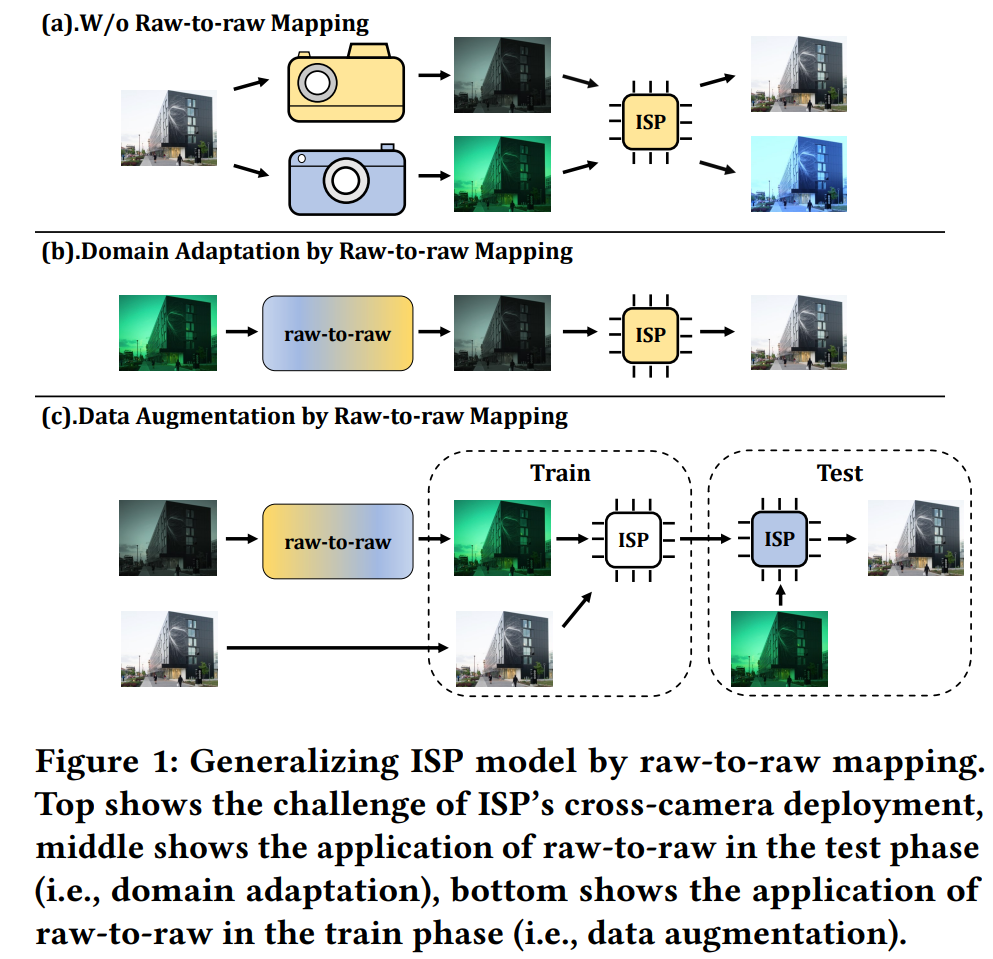

# Generalizing ISP Model by Unsupervised Raw-to-raw Mapping
Official pytorch implementation of "Generalizing ISP Model by Unsupervised Raw-to-raw Mapping" (2024 MM Oral).

## Conda Environment
1. conda create -n raw_to_raw python=3.11
2. conda activate raw_to_raw
3. conda install pytorch==2.1.0 torchvision==0.16.0 torchaudio==2.1.0 pytorch-cuda=11.8 -c pytorch -c nvidia
4. conda install pytorch_msssim scipy

## Data Pre-process
1. Download dataset from https://github.com/mahmoudnafifi/raw2raw?tab=readme-ov-file
2. run `python data_preprocess/0_raw_extration.py`
3. run `python data_preprocess/1_data_process_samsung_iphone.py`

## Train
1.run `CUDA_VISIBLE_DEVICES=0 python main.py --mode train`

## Test
1.run `CUDA_VISIBLE_DEVICES=0 python main.py --mode train`
